# Entertainment On Green — Application Architecture

```mermaid
flowchart TD
    %% ─── USER ENTRY POINT ───────────────────────────────────────────────
    User(["👤 User / Browser"])

    %% ─── FRONTEND ────────────────────────────────────────────────────────
    subgraph FE["Frontend  (index.html)"]
        direction TB
        UI_TABS["Tab Navigation\nDefects · Epics · Assessments\nTesting Status · Project Status"]
        UI_FILTERS["Filters & Search\n(Issue Type, App, Status, Iterations)"]
        UI_TABLE["Data Table\n(sort, search, paginate)"]
        UI_METRICS["Metric Cards\n(Critical, High, Past Due, Total)"]
        UI_REPORT["Report Modal\n(summary generation)"]
        UI_EXPORT["Export to Sheets Button"]
        UI_LIBS["Libraries:\nD3.js · PapaParse · Chart.js"]

        UI_TABS --> UI_FILTERS
        UI_FILTERS --> UI_TABLE
        UI_TABLE --> UI_METRICS
        UI_LIBS -.->|parse & visualise| UI_TABLE
    end

    %% ─── APPS SCRIPT LAYER ───────────────────────────────────────────────
    subgraph GAS["Google Apps Script Backend"]
        direction TB

        subgraph UTIL["Code_util.gs  —  Web App Infrastructure"]
            doGet["doGet()\nServes index.html"]
            getFF["getFeatureFlags()"]
            getLinks["getProjectLinks()"]
            getMapping["getDirectorTeamMapping()"]
            getDash["getDashboardName()"]
            validateJira["validateJiraConnection()"]
            validateFilter["validateFilterAccess()"]
            getHeaders["getJiraHeaders() / getJiraFetchOptions()"]
            getTokens["getJiraSecretKey()\ngetSlackBotToken()"]
            arrayToCsv["arrayToCsv()"]
            formatDate["formatJiraDate()"]
            sendSlackWrapper["sendToSlackWithOptions()\n(wrapper)"]
        end

        subgraph CORE["Core.gs  —  Central Configuration (no functions)"]
            CONFIG["CONFIG\n• DASHBOARD\n• FEATURE_FLAGS\n• JIRA filters (35173 / 38217)\n• SHEETS IDs\n• SLACK channels\n• API_SETTINGS (retry / backoff)"]
            FIELDMAP["FIELD_MAPPINGS\ncustomfield_* for\nSeverity · App · Env\nHealth · Cost · Status Risk"]
            DIRMAP["DIRECTOR_TEAM_MAPPING\n90+ teams → directors"]
            PROJLINKS["PROJECT_LINKS\nJIRA · RPP · Drive · Figma · Gate 0"]
        end

        subgraph DEFECTS["Code_defects.gs  —  Defects Module"]
            fetchJira["fetchJiraData()\n(pagination + retry)"]
            buildBody["buildJiraRequestBody()"]
            transformDefects["transformJiraData()\nRoutes fields by issue type\nSODP-Bug vs GREEN-Experience Defect"]
            fetchGtm["fetchGtmJiraData()\n(GTM launch gating)"]
            fetchTesting["fetchTestingStatusData()\n(Google Sheets read)"]
        end

        subgraph EPICS["Code_epic.gs  —  Epics & Stories Module"]
            fetchEpics["fetchEpicsData()\n(orchestrator)"]
            fetchEpicsFilter["fetchEpicsFromFilter()\n(filter 38217, paginated)"]
            fetchStories["fetchStoriesForEpics()\n(POST JQL: Parent IN epics)"]
            enrichStories["enrichStoriesWithParentInfo()"]
            transformEpics["transformEpicsData()\n(13-col CSV + ADF parsing)"]
        end

        subgraph COST["Code_cost.gs  —  Assessments & Cost Module"]
            fetchAssess["fetchAssessmentsData()\n(orchestrator)"]
            fetchAssessFilter["fetchAssessmentsFromFilter()"]
            transformAssess["transformAssessmentsData()\n(+ Gate 2 Cost Estimate col)"]
            exportSheet["exportAssessmentsToSheet()\n(write + format Google Sheet)"]
        end

        subgraph SLACK["Code_slack.gs  —  Slack Module"]
            getChannels["getSlackChannels()"]
            sendSlack["sendToSlack()\n(single channel, Block Kit)"]
            formatMsg["formatSlackMessage()\n(header + code block + timestamp)"]
            sendMulti["sendToSlackWithOptions()\n(multi-channel, split defects/epics)"]
        end
    end

    %% ─── SECRETS STORE ───────────────────────────────────────────────────
    subgraph PROPS["Google Script Properties  (Secrets)"]
        JIRA_KEY["JIRA_SECRET_KEY\n(Bearer token)"]
        SLACK_TOKEN["SLACK_BOT_TOKEN\n(Bearer token)"]
    end

    %% ─── EXTERNAL SERVICES ───────────────────────────────────────────────
    subgraph EXT["External Services"]
        JIRA["JIRA Cloud\n/rest/api/3/search/jql\n(POST — defects, stories)\n(GET  — epics, filters)\nFilters: 35173 · 38217"]
        GSHEETS_READ["Google Sheets (Read)\nTesting Status\nsheet ID: 1vSVw…\nGID: 1819050178"]
        GSHEETS_WRITE["Google Sheets (Write)\nAssessments Export\nsheet ID: 1mh-Gc…"]
        SLACK_API["Slack Web API\nchat.postMessage\nBlock Kit format"]
    end

    %% ─── CONNECTIONS ─────────────────────────────────────────────────────

    %% User ↔ Frontend
    User -->|HTTP GET| doGet
    doGet -->|HtmlService| FE
    User <-->|interacts| FE

    %% Frontend → Apps Script (google.script.run calls)
    UI_TABS -->|"fetchJiraDataAsCsv()"| fetchJira
    UI_TABS -->|"fetchEpicsData()"| fetchEpics
    UI_TABS -->|"fetchAssessmentsData()"| fetchAssess
    UI_TABS -->|"fetchTestingStatusData()"| fetchTesting
    UI_REPORT -->|"sendToSlackWithOptions()"| sendSlackWrapper
    UI_EXPORT -->|"exportAssessmentsToSheet()"| exportSheet
    UI_TABS -->|getFeatureFlags / getProjectLinks\ngetDirectorTeamMapping| getFF

    %% Config consumed by all modules
    CORE -.->|constants & mappings| DEFECTS
    CORE -.->|constants & mappings| EPICS
    CORE -.->|constants & mappings| COST
    CORE -.->|constants & mappings| SLACK
    CORE -.->|constants & mappings| UTIL

    %% Util shared helpers
    getHeaders --> DEFECTS
    getHeaders --> EPICS
    getHeaders --> COST
    arrayToCsv --> DEFECTS
    arrayToCsv --> EPICS
    arrayToCsv --> COST
    formatDate --> DEFECTS
    formatDate --> EPICS
    getTokens --> getHeaders
    getTokens --> SLACK

    %% Defects internal flow
    fetchJira --> buildBody
    buildBody -->|POST JQL| JIRA
    JIRA -->|raw JSON| transformDefects
    transformDefects -->|11-col CSV array| arrayToCsv

    %% Epics internal flow
    fetchEpics --> fetchEpicsFilter
    fetchEpicsFilter -->|GET filter 38217| JIRA
    JIRA -->|epic issues| fetchStories
    fetchStories -->|POST Parent IN epics| JIRA
    JIRA -->|stories| enrichStories
    enrichStories --> transformEpics
    transformEpics -->|13-col CSV array| arrayToCsv

    %% Cost / Assessments internal flow
    fetchAssess --> fetchAssessFilter
    fetchAssessFilter -->|GET filter 38217| JIRA
    JIRA -->|assessment issues| transformAssess
    transformAssess -->|CSV + cost col| arrayToCsv
    exportSheet -->|write + format| GSHEETS_WRITE

    %% Testing Status
    fetchTesting -->|SpreadsheetApp read| GSHEETS_READ

    %% Slack flow
    sendSlackWrapper --> sendMulti
    sendMulti --> sendSlack
    sendSlack --> formatMsg
    formatMsg -->|Block Kit POST| SLACK_API

    %% Secrets
    PROPS -->|token lookup| getTokens

    %% CSV back to frontend
    arrayToCsv -->|CSV string| FE
    FE -->|PapaParse → render| UI_TABLE

    %% Validation
    validateJira -->|test POST| JIRA
    validateFilter -->|GET /filter/:id| JIRA

    %% ─── STYLES ──────────────────────────────────────────────────────────
    classDef ext fill:#dbeafe,stroke:#2563eb,color:#1e3a8a
    classDef fe  fill:#dcfce7,stroke:#16a34a,color:#14532d
    classDef gas fill:#fef9c3,stroke:#ca8a04,color:#713f12
    classDef sec fill:#fce7f3,stroke:#db2777,color:#831843

    class JIRA,GSHEETS_READ,GSHEETS_WRITE,SLACK_API ext
    class FE,UI_TABS,UI_FILTERS,UI_TABLE,UI_METRICS,UI_REPORT,UI_EXPORT,UI_LIBS fe
    class GAS,UTIL,CORE,DEFECTS,EPICS,COST,SLACK gas
    class PROPS,JIRA_KEY,SLACK_TOKEN sec
```

---

## Architecture Summary

| Layer | Components | Purpose |
|---|---|---|
| **Frontend** | `index.html` + D3/PapaParse/Chart.js | Multi-tab dashboard UI; calls backend via `google.script.run` |
| **Entry Point** | `Code_util.gs → doGet()` | Serves HTML app; provides shared helpers, validation, token access |
| **Configuration** | `Core.gs` | All constants: JIRA filters, field mappings, Slack channels, feature flags |
| **Defects Module** | `Code_defects.gs` | Fetches & transforms Bug/Experience Defect issues; reads Testing Status sheet |
| **Epics Module** | `Code_epic.gs` | Fetches epics → stories hierarchy; parses ADF rich text |
| **Assessments Module** | `Code_cost.gs` | Fetches assessments + cost estimates; exports to Google Sheets |
| **Slack Module** | `Code_slack.gs` | Sends Block Kit messages to one or more Slack channels |
| **Secrets** | Script Properties | Secure storage for `JIRA_SECRET_KEY` and `SLACK_BOT_TOKEN` |
| **External APIs** | JIRA · Google Sheets · Slack | Data source, export target, notification channel |
